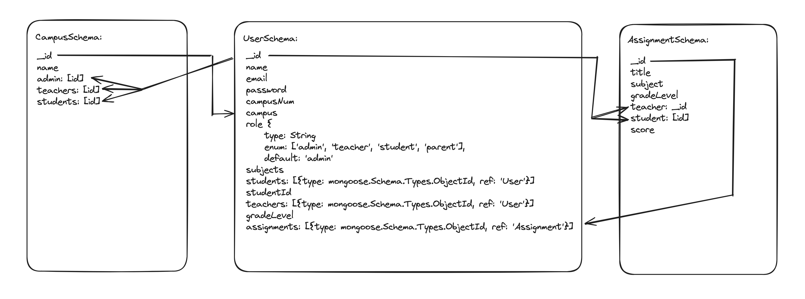

Dean's List is a dynamic online platform revolutionizing education through its innovative approach to Response to Intervention (RTI). With a mission to address the challenges faced in education, Dean's List offers a comprehensive suite of tools and resources designed to empower educators, students, and parents alike. By leveraging cutting-edge technology and expert insights, Dean's List aims to create a supportive environment where every learner can thrive. Join us on our journey to transform education and unlock the full potential of every student.


## Steps


**Start with Installation of Packages and Running Server**
```bash
npm i
```
### next
```bash
npm run dev
```

**Utilize Postman to create initial Campus**
```
const campusSchema = new Schema({
    name: { required: true, type: String },
    campusNum: String,
    district: { required: true, type: String },
    state: { required: true, type: String },
    city: { required: true, type: String },
    address: { required: true, type: String },
    zipCode: { required: true, type: String },
    admins: [{ type: mongoose.Schema.Types.ObjectId, ref: 'User' }],
    students: [{ type: mongoose.Schema.Types.ObjectId, ref: 'User' }],
    teachers: [{ type: mongoose.Schema.Types.ObjectId, ref: 'User' }],
    parents: [{ type: mongoose.Schema.Types.ObjectId, ref: 'User' }],
    score: String,
}
```
Follow the model to create an initial campus. Before being able to create an administrator, this step has to be completed. Be sure to leave the campuNum blank as it will be autopopulated upon creation. That campusNum will be utilized to create the initial administrator.

Create the initial campus with the following route:
localhost:(PORT)/api/campuses

**Utilize Postman to Create Inital Administrator**
```
const userSchema = new Schema({
    firstName: { required: true, type: String },
    lastName: { required: true, type: String },
    email: { required: true, type: String, unique: true },
    password: { type: String, required: true },
    campusNum: String,
    campus: String,
    role: {
        type: String,
        enum: ['admin', 'teacher', 'student', 'parent'],
        default: 'admin'
    },
    subjects: [String],
    admins: [{ type: mongoose.Schema.Types.ObjectId, ref: 'User' }],
    teachers: [{ type: mongoose.Schema.Types.ObjectId, ref: 'User' }],
    gradeLevel: String,
    assignments: [{ type: mongoose.Schema.Types.ObjectId, ref: 'Assignment' }],
    students: [{ type: mongoose.Schema.Types.ObjectId, ref: 'User' }],
    studentId: String,
    parents: [{ type: mongoose.Schema.Types.ObjectId, ref: 'User' }]
}
```

Follow the model to create an initial administrator with which you will create more users to populate the campus. Before being able to create an administrator, you must manually input the campusNum that was received upon creation of the campus.

Create the initial campus with the following route:
localhost:(PORT)/api/users/admin

**Utilize Postman to Create Lower Tier Users (teachers, students, parents)**
Follow the same model to continue creating other users. There must be an initial user logged in to create other lower tier users. Without the creation of an administrator, it is not possible to create other users.

Create the initial campus with the following route:
localhost:(PORT)/api/users